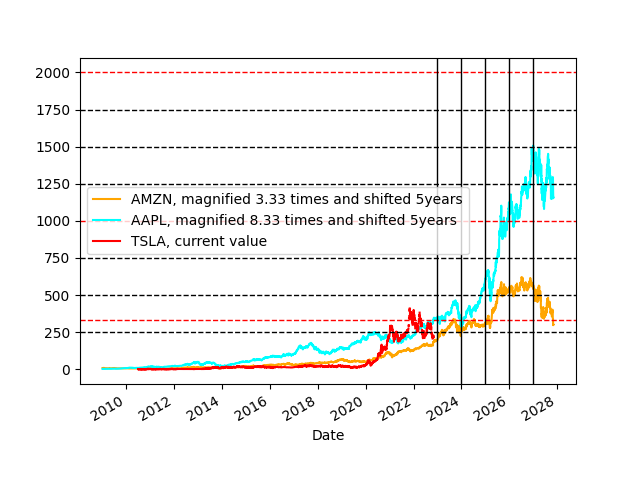

# Bora's Jupyter Notebooks

A clutter of jupyter notebooks I have been writing, for public eyes...

Drawing by my daughter Nina when she was 7; hands and keyboard added by [Dall-E](https://openai.com/dall-e-2/) when it was 1.

## AI# Series

These are notebooks written whilst going through [Andrej Karpathy](https://github.com/karpathy)'s excellent Youtube series, [Neural Networks: Zero to Hero](https://www.youtube.com/watch?v=VMj-3S1tku0&list=PLAqhIrjkxbuWI23v9cThsA9GvCAUhRvKZ).

The numbering follows the playlist order, but seperated into multiple parts for each video in an effort to keep the code tidy and modular.

## TSLA

A simple forecast for the range of TSLA stock price using the historical prices from AMZN and AAPL. Here is a snapshot created on 8th November 2022, when TSLA was hovering at 52-week lows:

## License

MIT. 
